# Revisión visual y funcional de la API / plataforma

Este documento reúne capturas de pantalla y observaciones puntuales sobre la interfaz, las validaciones y los errores visibles detectados durante la revisión.

## Hallazgos principales

- **Ortografía y consistencia:** aparecen varios textos sin tildes o con escritura inconsistente (`sesion`, `terminos`, `revision`, `pagina`, `numero`, `contrasena`).
- **Validaciones faltantes:** varios formularios aceptan texto, números o correos inválidos sin bloquear el envío.
- **Errores técnicos:** se detecta al menos un fallo fuerte en la documentación OpenAPI/Swagger por **indentación inválida** y **falta de versión**.
- **Manejo de errores mejorable:** en algunas pantallas el sistema responde con mensajes genéricos que no explican qué falló ni cómo corregirlo.

> Nota: la redacción de cada observación puede ampliarse o ajustarse según el criterio de entrega.

---

## 1. Login

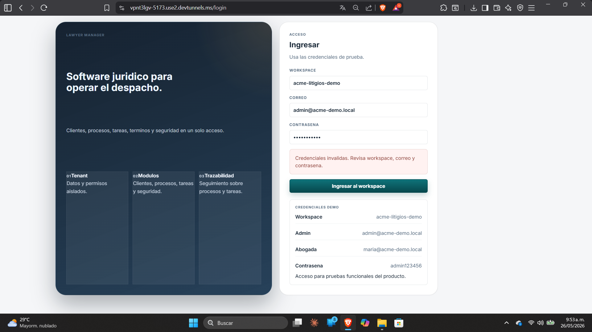

**Observaciones**
- Falta el apartado de **registro**.
- Falta el enlace de **recuperar contraseña**.
- No se aprecian validaciones claras para:
  - workspace
  - correo
  - contraseña
- Aparece el mensaje de credenciales inválidas, pero sin orientación adicional.
- Se observa inconsistencia de idioma: `workspace` está en inglés dentro de una interfaz en español.
- En `CONTRASENA` falta la forma correcta con `Ñ` (`CONTRASEÑA`).

---

## 2. Dashboard

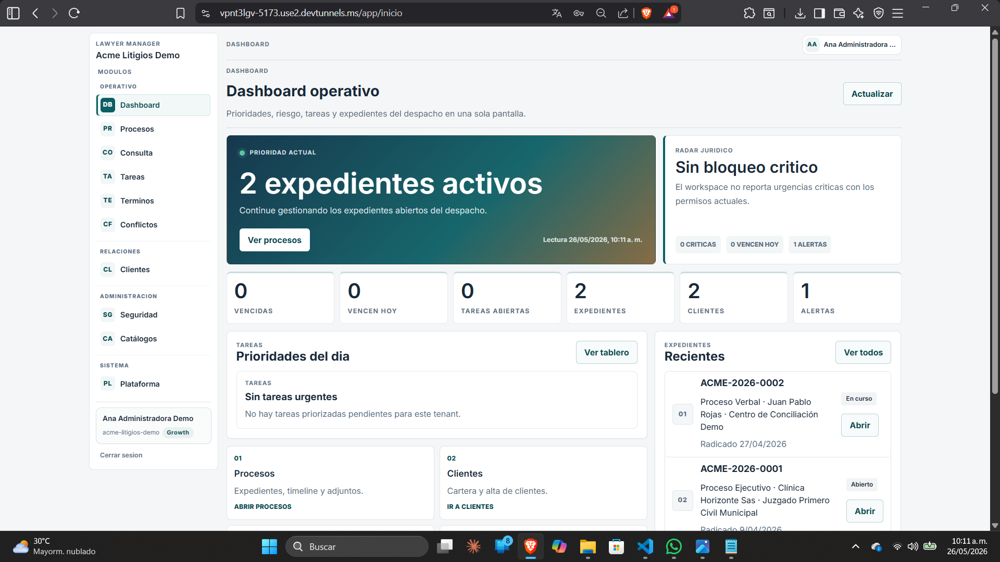

**Observaciones**
- La vista general está funcional, pero el texto **Cerrar sesion** debería ir como **Cerrar sesión**.
- Revisar consistencia de tildes y estilo en los botones y rótulos secundarios.
- La información de estado se ve cargada, pero conviene validar que no se muestre contenido vacío o de prueba en ambiente real.

---

## 3. Clientes - Alta / formulario

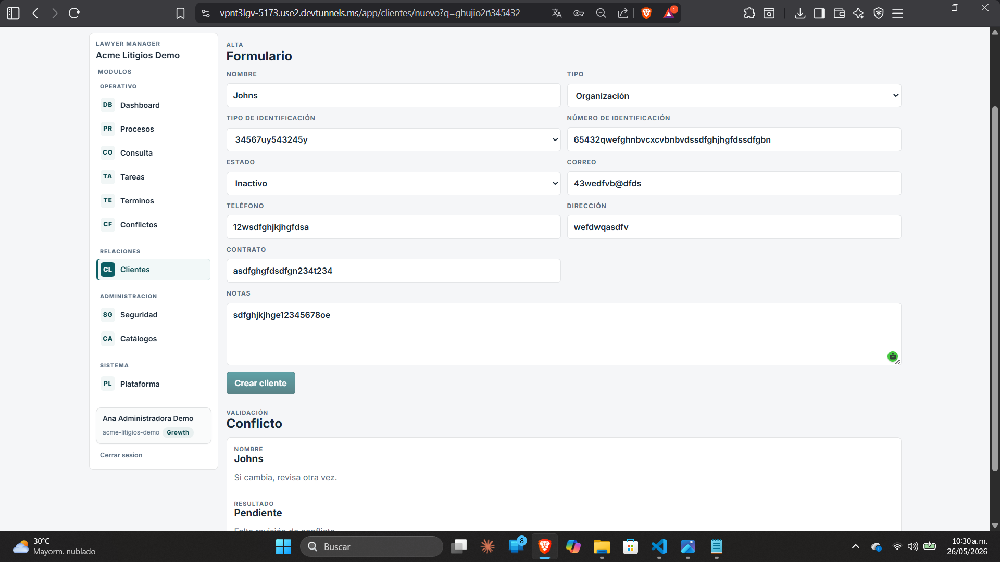

**Observaciones**
- El formulario acepta datos claramente inválidos:
  - nombres con números y caracteres aleatorios
  - correo sin formato válido
  - teléfono con letras
  - dirección y contrato con texto de prueba
- Falta validación de:
  - formato de correo
  - longitud mínima y máxima
  - solo números en teléfono e identificación, según aplique
  - campos obligatorios
- El botón **Crear cliente** aparece disponible aun con datos no válidos.
- En una revisión formal, este formulario debería bloquear el envío hasta corregir el contenido.

---

## 4. Clientes - listado

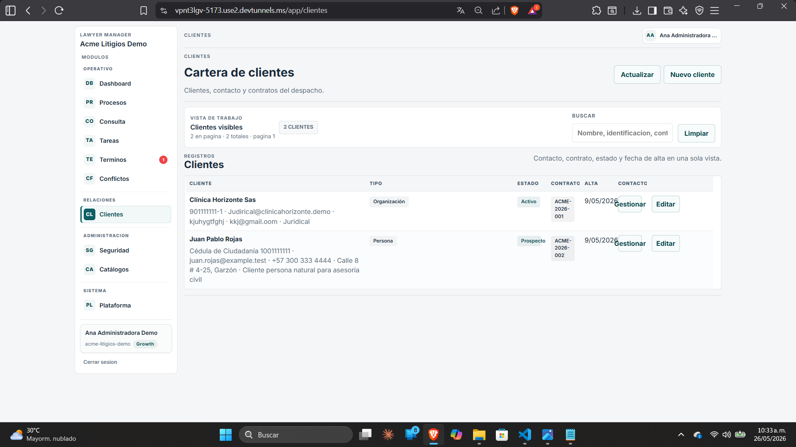

**Observaciones**
- La tabla se ve ordenada, pero conviene revisar:
  - consistencia en el formato de fecha
  - longitud de los textos en columnas
  - alineación de botones de acción
- El buscador muestra texto de ayuda que podría recortarse o quedar más claro.
- El texto **Cerrar sesion** también debería ir con tilde: **Cerrar sesión**.

---

## 5. Conflictos - nueva revisión

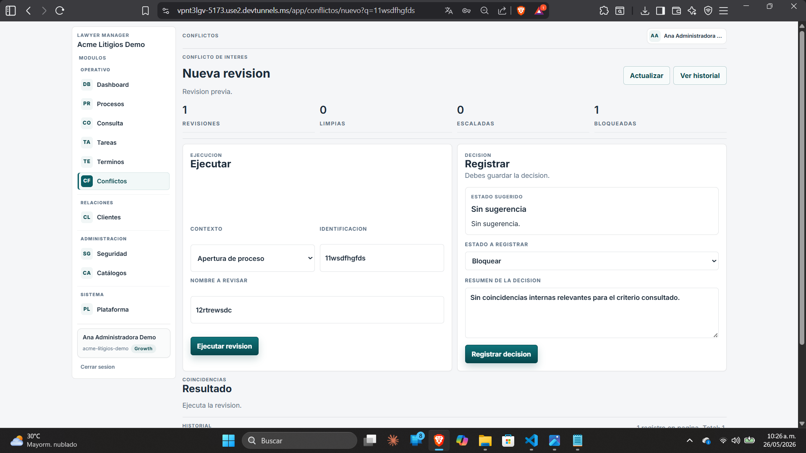

**Observaciones**
- La interfaz permite ingresar datos de prueba sin validación visible.
- Sería ideal validar:
  - nombre a revisar
  - identificación
  - contexto seleccionado
  - obligatoriedad de la decisión
- Se observa la escritura **Nueva revision** / **Revision previa**, que debería ser **Nueva revisión** / **Revisión previa**.

---

## 6. Conflictos - historial

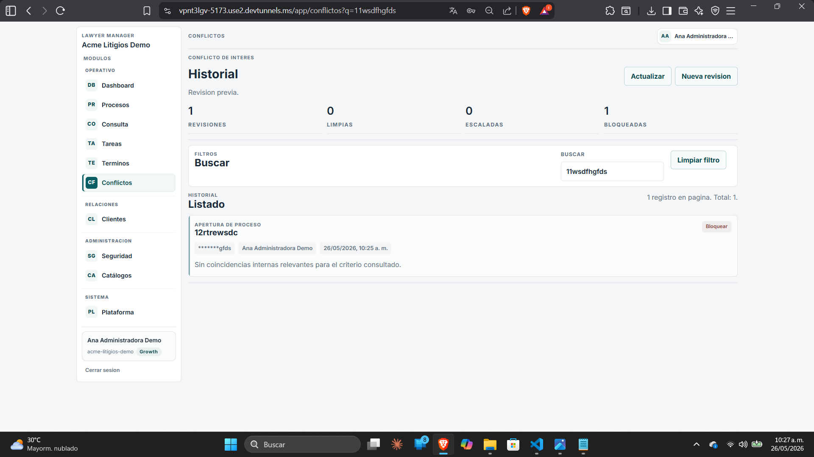

**Observaciones**
- Se repite el problema de ortografía: **Revision** debería ser **Revisión**.
- El filtro de búsqueda funciona visualmente, pero conviene asegurar que el resultado realmente filtre por criterios exactos.
- El texto descriptivo podría ser más claro para el usuario final.

---

## 7. Consulta de procesos

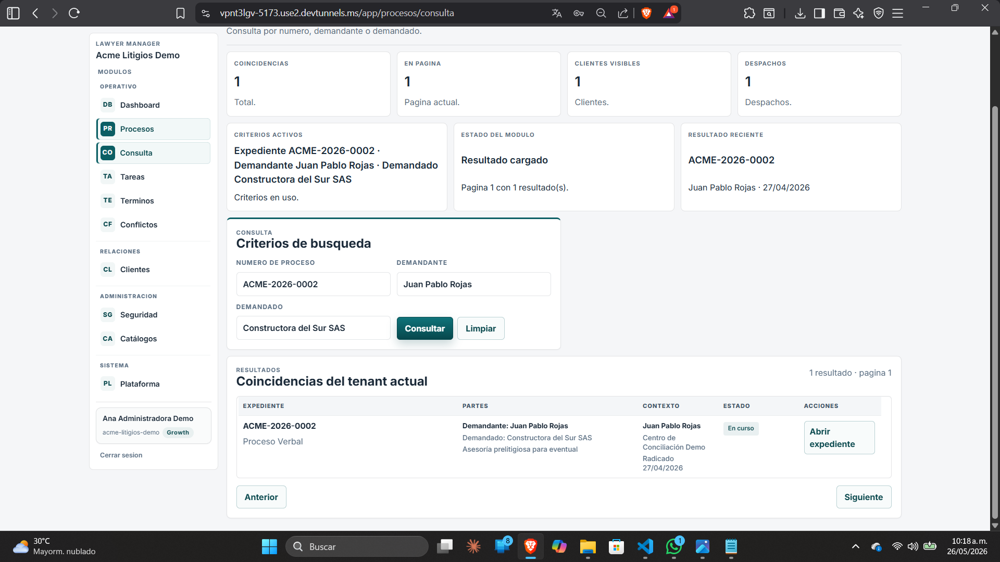

**Observaciones**
- La búsqueda acepta valores de prueba y texto libre; falta validación del criterio de consulta.
- Hay detalles de ortografía:
  - **numero** debería ser **número**
  - **Pagina actual** debería ser **Página actual**
- Conviene revisar que el buscador no permita resultados ambiguos o vacíos sin advertencia.

---

## 8. Catálogos

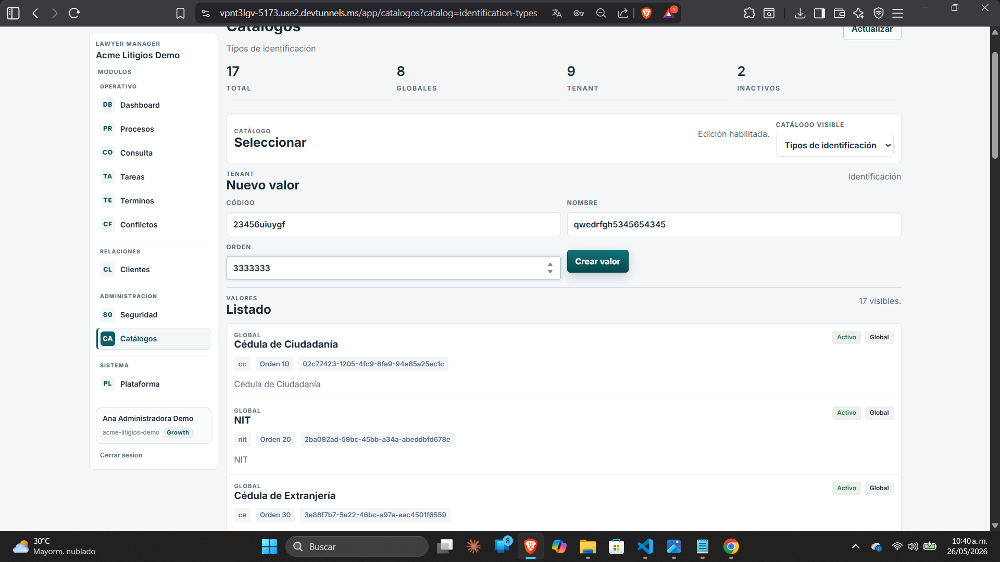

**Observaciones**
- Los campos permiten valores claramente incorrectos:
  - código con mezcla de letras y números
  - orden con número excesivo
- Falta validación de rango, tipo y formato.
- Sería recomendable bloquear la creación si el código o el nombre no cumplen reglas mínimas.
- Revisar también coherencia de nombres y mayúsculas en los listados.

---

## 9. Procesos - radicación

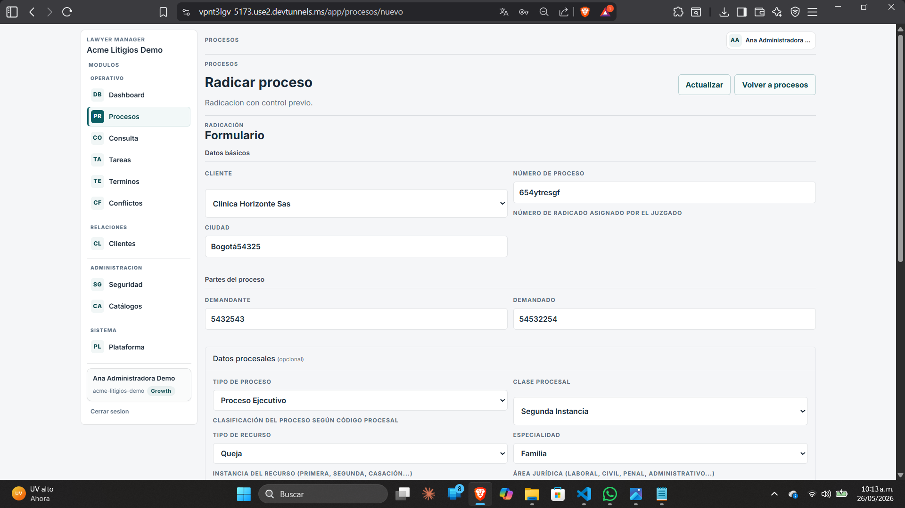

**Observaciones**
- El formulario acepta datos de prueba en casi todos los campos.
- Faltan validaciones de:
  - número de proceso
  - ciudad
  - demandante
  - demandado
  - radicado asignado por el juzgado
- Algunos campos deberían ser obligatorios y otros deberían tener formato específico.
- El sistema debería impedir avanzar si el expediente no cumple los criterios mínimos.

---

## 10. Procesos - control previo

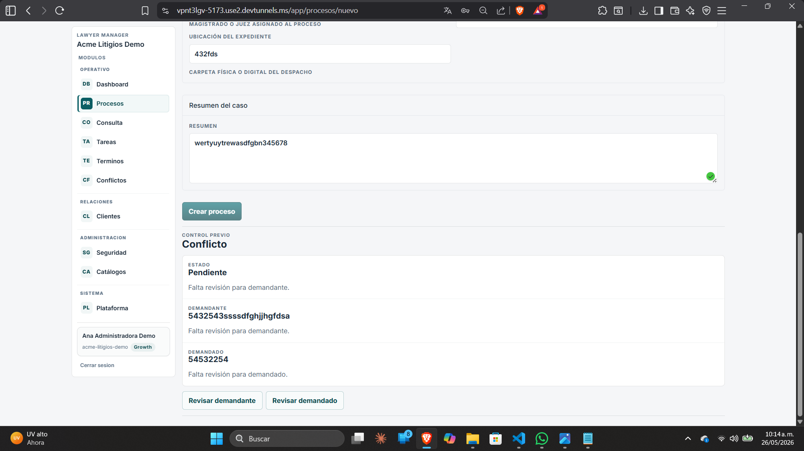

**Observaciones**
- El estado **Pendiente** muestra que falta revisión, lo cual es correcto como flujo, pero conviene reforzar la validación para que no se pueda finalizar el proceso antes de revisar.
- Hay datos de prueba en los campos de demandante y demandado.
- El mensaje **Falta revisión para demandante/demandado** sugiere una regla de negocio, pero debería quedar más explícito si bloquea o no la acción.

---

## 11. Seguridad - nuevo usuario

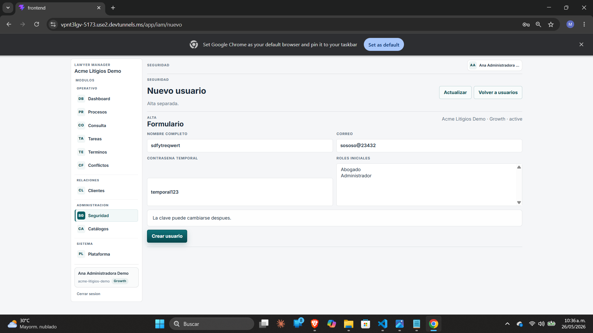

**Observaciones**
- Se detectan datos inválidos en correo y nombre.
- La contraseña temporal debería validar longitud, complejidad y formato.
- Falta confirmar si el rol puede seleccionarse de forma controlada o si admite combinaciones no permitidas.
- El texto **La clave puede cambiarse despues.** debería ir como **después**.
- También sería útil un segundo campo de confirmación o una política de contraseña visible.

---

## 12. Seguridad - error general

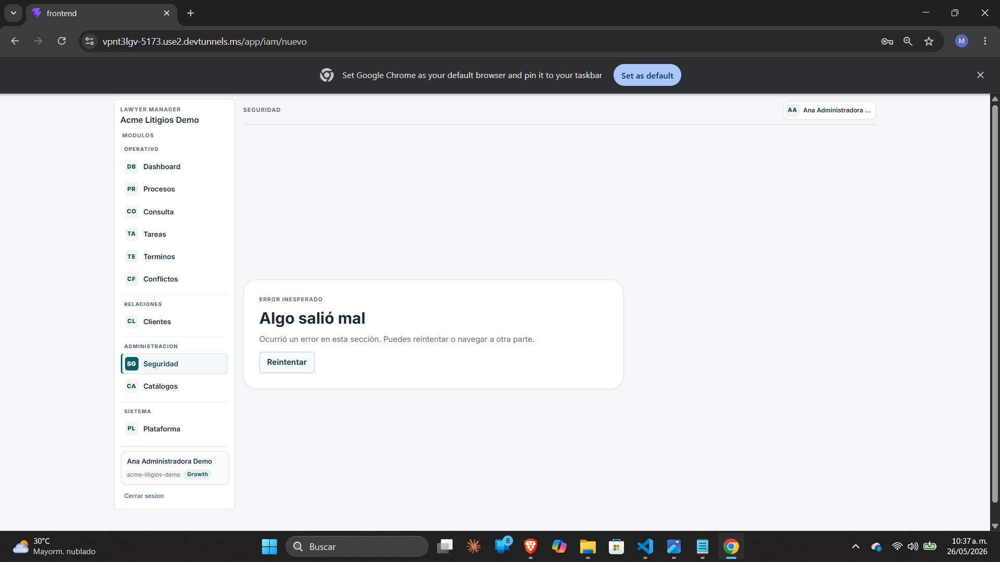

**Observaciones**
- La pantalla muestra un error genérico: **Algo salió mal**.
- Falta información técnica o funcional que ayude a identificar la causa.
- Sería mejor mostrar:
  - código de error
  - sugerencia de acción
  - referencia para soporte
- Este punto sirve como evidencia de manejo de errores insuficiente.

---

## 13. Tareas

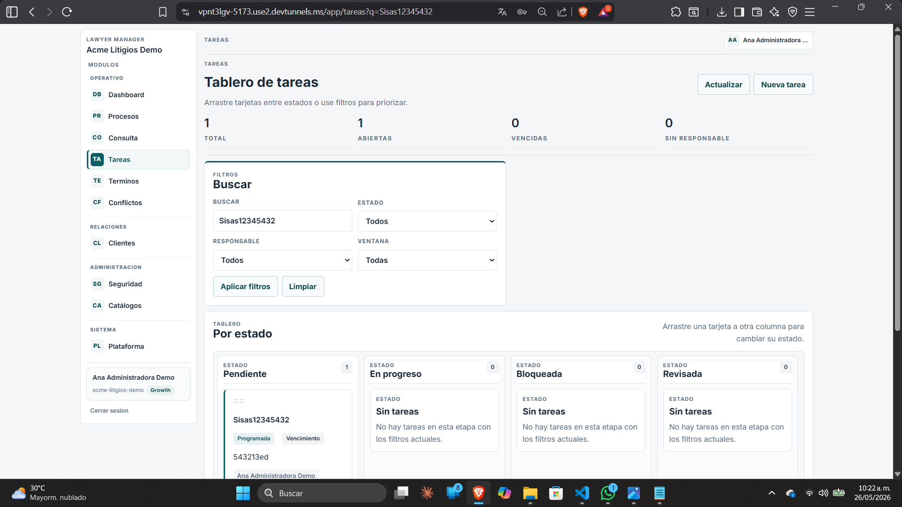

**Observaciones**
- El campo de búsqueda contiene texto de prueba, lo que sugiere que no hay validación de entrada.
- Revisar el comportamiento cuando no hay resultados, cuando el campo está vacío o cuando el texto supera cierta longitud.
- Los estados y contadores se ven bien, pero conviene validar que reflejen datos reales.
- Podría mejorarse la claridad en filtros y etiquetas.

---

## 14. Términos / alertas

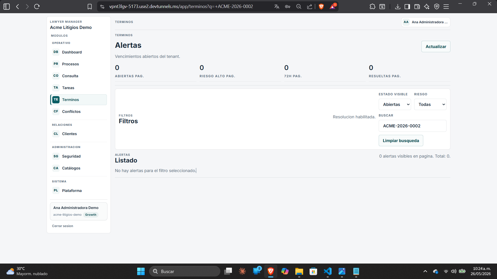

**Observaciones**
- Hay varios problemas ortográficos:
  - **Terminos** debería ser **Términos**
  - **Resolucion** debería ser **Resolución**
  - **pagina** debería ser **página**
- El módulo se muestra como **Alertas**, pero la navegación lateral sigue identificándolo como términos, así que conviene revisar consistencia de nombre.
- El estado cero está bien, pero podría acompañarse de un mensaje más útil.

---

## 15. Plataforma - contrato operativo

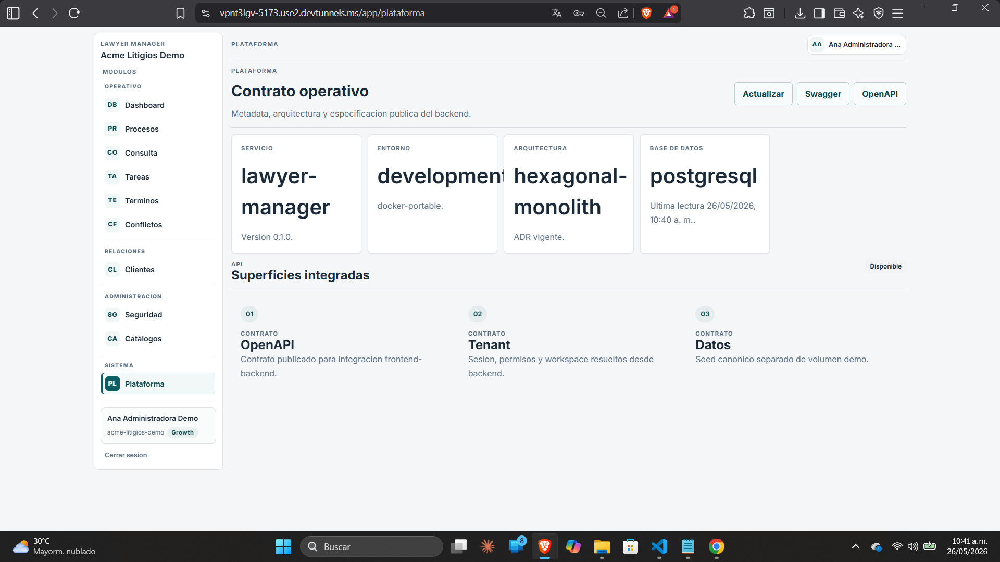

**Observaciones**
- Se observan mezclas de inglés y español en la nomenclatura del módulo, algo que conviene unificar.
- Revisar ortografía en textos como:
  - **Sesion** → **Sesión**
  - **canonico** → **canónico**
  - **Ultima lectura** → **Última lectura**
- El contenido parece más de configuración interna que de cara al usuario final, así que conviene revisar si realmente debe mostrarse así.
- También sería útil validar que los datos del contrato no estén expuestos si no corresponden al ambiente.

---

## 16. Plataforma - Swagger / OpenAPI roto

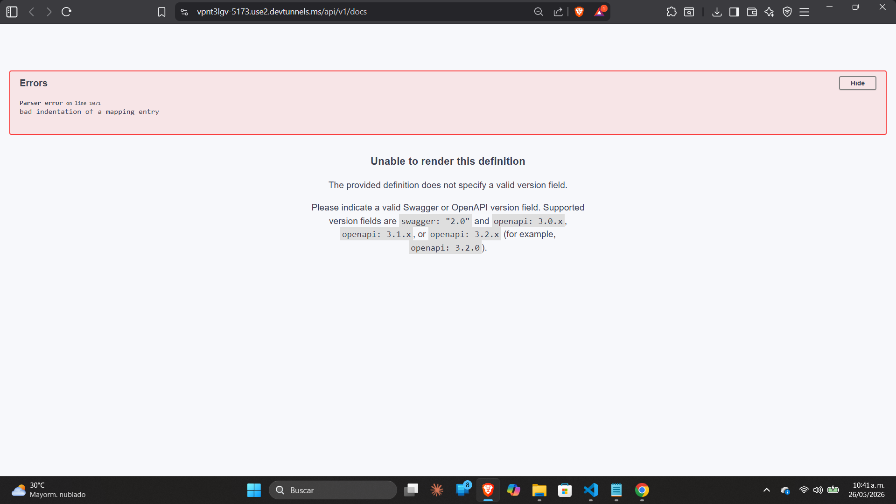

**Observaciones**
- Aquí aparece un error técnico fuerte:
  - **Parser error on line 1071**
  - **bad indentation of a mapping entry**
  - además indica que no puede renderizar la definición
- También se reporta que falta un campo válido de versión (`swagger` o `openapi`).
- Este fallo impide abrir la documentación correctamente y debe corregirse antes de entregar.
- Es una evidencia clara de problema en el archivo YAML / OpenAPI.

---

## 17. Plataforma - archivo OpenAPI en editor

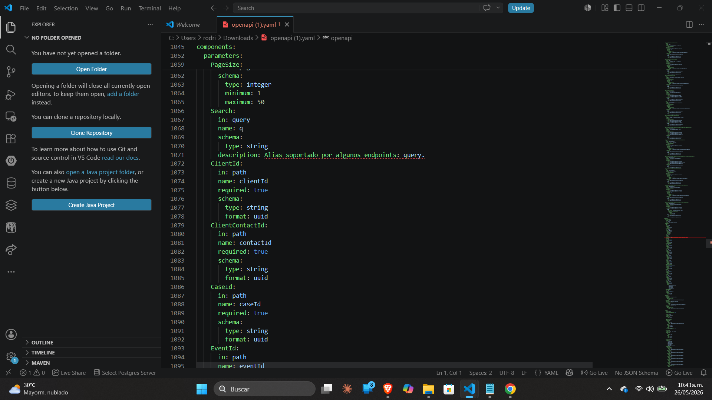

**Observaciones**
- La captura confirma que el archivo YAML está abierto en el editor y que el problema viene de la especificación.
- Se debe revisar:
  - indentación
  - estructura de `paths`
  - encabezado `openapi:` o `swagger:`
  - sintaxis de parámetros y descripciones
- Esta imagen sirve como soporte técnico para justificar el error de Swagger.

---

## Cierre

Con estas capturas ya se evidencia:
- falta de validación en formularios,
- errores de ortografía,
- mensajes genéricos de falla,
- y un problema real en la documentación OpenAPI.